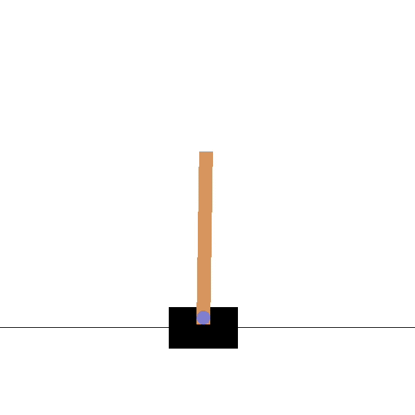

# Reinforcement Learning

Project for CS 682: Artificial intelligence

## Objectives

To implement a reinforcement learning algorithm that can learn a policy for a given task based on task-based rewards. To take a continuous environment and discretize it so that it is suitable for a reinforcement learning task.

## Task Description

  

This is the CartPole task. The idea here is to balance this pole using a one-dimensional
action (it can only move left and right). The agent's state has 4 components:

- x: the location of the robot (0 is the center, -2.4 is the leftmost part of the board, 2.4 is the rightmost part of the board)
- xdot: the velocity of the robot (technically, this can go from -inf to inf)
- theta: the angle that the pole is at (0 is straight up, -12 degrees or fewer means that the pole falls to the left, 12 degrees or more means that the pole falls to the right)
- thetadot: the change in angle per second.

The robot can choose between two actions:

- 0: move left
- 1: move right

Success is balancing for 200 ticks, failure is if the stick falls more than 12 degrees from the median, or if the robot moves more than 2.4 meters from the center.

### Example Code

In the Canvas,

> Files->Projects->Project 2->cart.py

> For training, call: python3 cart.py --train
>
> For testing, call: python3 cart.py --test --model \<model file>

### OpenAI Gym

You do not have to implement the problem domain yourself, there is a resource called openAI gym which has a set of common training examples. Gym can be installed on unix based system with the following command:

> sudo -H pip3 install gym

After running the provided command, you may also be asked to install some additional packages for the video encoding. You'll see an error message with instructions to follow.

### State Discretization

We will discretize the space in order to simplify the reinforcement learning algorithm. For each state we determine the realistic minimum and maximum values and store it in arrays MIN_VALS and MAX_VALS respectively (line 14 and 15). These arrays are then used to discretize each element of the state into respective NUM_BINS (line 16). For example, state(0) i.e., position (x) with minimum and maximum value of -2.5 and +2.5, respectively, is discretized into 9 bins in the example code (cart.py) which implies that for x<-2.5 will be one bucket, -2.5<x<-1.875 will be another and so on.

These state components are encoded into a single integer state (0 ... 9999). This is done for you in the function discretize_state in the provided code.

## Task (part 1)

You need to implement the q-learning part of this task (right now the example code will not do any learning). You need to implement the following equation from the lecture slides:

> Q-values can be learned directly from reward feedback
>
> Q(a,s) ← Q(a,s) + α(R(s) + 𝛾 * max a' Q(a',s’) - Q(a,s))

Here, s is the current state, s' (sprime) is the next state, and a is the current action. The above equation needs to be implemented on line 142. Reward is stored in the variable reward, and the learning rate (α) is in the variable alpha, which is set on line 101. The predicted value of the next state, max_a'Q(a',s'), is already computed and stored in the variable predicted_value.

You'll need to implement the equation on line 142 and tune the values of the parameters alpha and gamma (lines 101 and 101, respectively). You should only have to write one line of code and adjust some values for this part. It is suggested that you step the alpha (learning rate) values up and down by factors of .1 in both directions and the gamma values by .1 in both directions to see the effect it has on the learning. Usually learning
rate is kept low such that the policy does not take huge step toward convergence and miss the local minima, eventually diverging from it. Gamma, on the other hand, represents the discount factor which essentially means how much the policy prefers current reward over future rewards.

The program will train over 50001 episodes and play a video of each 1000th training.

This is easy on the code side and will allow you to experiment with the various factors of reinforcement learning.

## Task (part 2)

  

Now that you've implemented q-learning for one task, you will move to the mountain car task. Instead of 2 actions (left, right), this task has three (left, null, right). The task also has different state variables (only 2 for mountain car)

- x: the location of the robot (-1.2 is the left, -.45 is approximately the valley, 0.6 is the rightmost part of the board, 0.5 is the location of the flag)
- xdot: the velocity of the robot (this can go from -0.07 to 0.07)

This will require you to change the following:

- Q-function, Gamma, Alpha:
  - First, similar to Part 1, copy the working Q-function and parameters from Part 1 to car.py
- Minimum values, maximum values and number of bins:
  - MIN_VALS = [ ]
  - MAX_VALS = [ ]
  - NUM_BINS = [ ]
- Total number of possible states:

  Depending on the NUM_BINS, you need to set the number of possible states. For example, in the cartpole problem in Part I, there was 10 bins for each variable, leading to 10 * 10 * 10 * 10 - 1 = 9999 states. Now you have 2 variables. Assuming that you have Y bins for each variable, you will end up with Y*Y-1 states. Replace 9999 in line 87 with the appropriate number whenever you change the values in NUM_BINS.

## Implementation

### Part 1

After a few trying of tunning parameters, we got a good result for the cartpole problem for the following parameters:

    - alpha = 0.1
    - gamma = 0.9

The code for Part 1 is provided in the file cart.py. You can run the code by calling:

    > python3 cart.py --train

The model file is also provided in the project and saved as cartpole.npy. You can use it to test the code by calling:

    > python3 cart.py --test --model cartpole.npy

### Part 2

For the mountain car problem, we will use the following parameters:

    - alpha = 0.5
    - gamma = 0.9

Minimum values, maximum values and number of bins:

    - MIN_VALS = [-1.2, -0.07]
    - MAX_VALS = [0.6, 0.07]
    - NUM_BINS = [100, 100]

The code for Part 2 is provided in the file car.py. You can run the code by calling:

    > python3 car.py --train

The model file is also provided in the project and saved as car.npy. You can use it to test the code by calling:

    > python3 car.py --test --model car.npy
